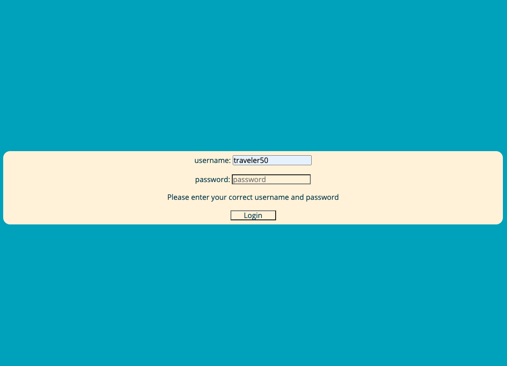
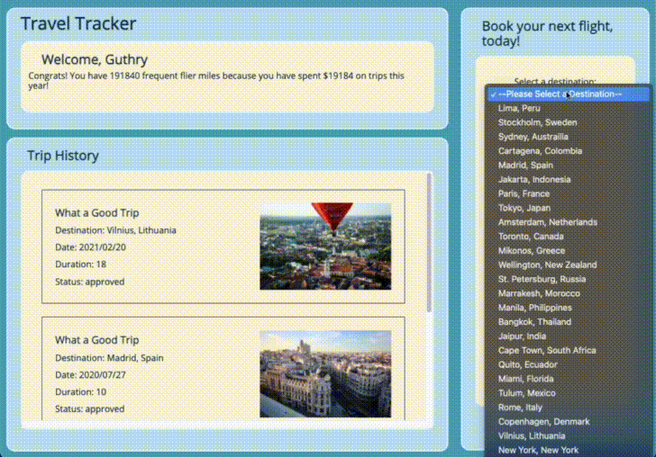

# Travel Tracker

## Table of Contents
* [Description](#description)
* [Installation](#installation)
* [Walkthrough](#walkthrough)
* [Authors](#authors)
* [Technologies](#technologies)

## Description
The goal of this project was to use OOP to drive code, work with an API to send and receieve data, and create a robust test suite that tests all functionality of a client-side application. It was built over 5 days during week 12 of the Turing front end program.  

The app is a travel booking site which includes a login page that accepts a specific username and password to access the travel data of 50 travelers from across an API. Try username: traveler50 with the password: travel2020. If the user does not enter the correct login information for a valid user, a message will be displayed prompting them to enter valid data. Once logged in, the user can see booked trips in order of newest to oldest by trip date. The user is also able to see how much was spent on trips in the past calendar year. The user may input data for a new trip and get a cost estimate and book a new flight, which will be added to their trips with a pending status so long as the form was completely filled out. If any elements of the form are missing, the user will be prompted to complete it.

My goal for this project was to become more comfortable with network requests and more efficient in my project planning. I do feel a lot more confident in my ability to break a large project into chunks and create a plan for tackling it. I also feel more efficient in the code I write, having a stronger grasp of how to balance writing DRY code with creating a deliverable product. Due to personal matters, I was only able to work on the project for 5 of the 7 days given to complete the project. I learned a lot about organizing my time to ensure that the minimum viable product was complete without issues. With more time, I would love to add to the design of the page and build out more functionality to include a travel agent login that could view pending trip requests, income generated this year, and view/approve/delete trips.

### Notable features
* Responsive Design for easy use on either a desktop or mobile device
* Automatically updates the trip history section with new trip data by use of well-timed fetch requests to the API
* Error handling to ensure the user provides all of the needed information in order to log in an create a trip
* The ability to log in as any user that exists in the API

### Deploy Link

## Installation
1. In another terminal tab, clone down the repository at https://github.com/turingschool-examples/travel-tracker-api
2. Run npm install
3. Run npm start
4. Clone down this repository (https://github.com/RMartin0717/travel-tracker) to your machine
5. Access cloned directory
6. Run npm install
7. Run npm start and visit localhost:8080

## Walkthrough
When the user reaches the landing page, they must login with a username and password. The username must be the word "traveler" followed by any number from 1 to 50. For example, "traveler39". The password for every user is "travel2020". Upon login, they will have access to this traveler's history of past, present, upcoming, and pending trips as well as be able to book a new trip and see how much has been spent on travel in the past calendar year.

Login Page

Desktop

Mobile

## Authors
<table>
    <tr>
        <td> Riley Martin <a href="https://github.com/RMartin0717">GH</td>
    </tr>
    </tr>
        <td></td>
    </tr>
</table>

## Technologies
<table>
    <tr>
        <td>Functionality</td>
        <td>Structure</td>
        <td>Styling</td>
    </tr>
    </tr>
        <td></td>
        <td></td>
        <td></td>
    </tr>
</table>
